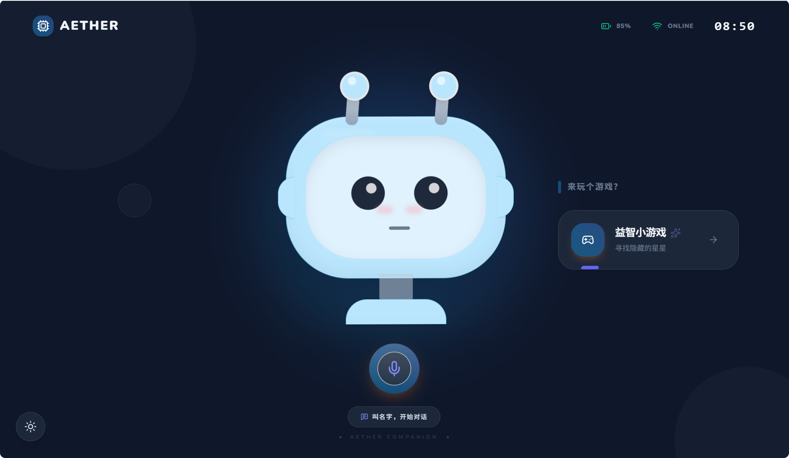
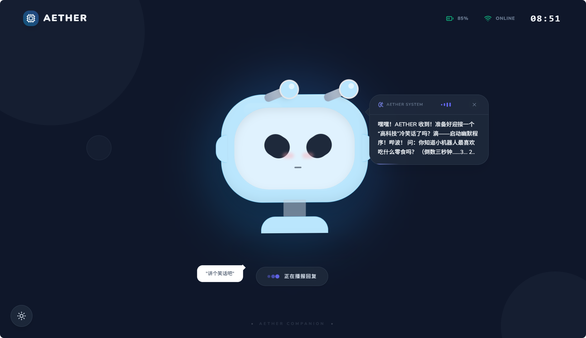
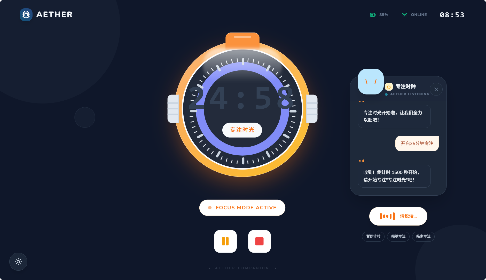
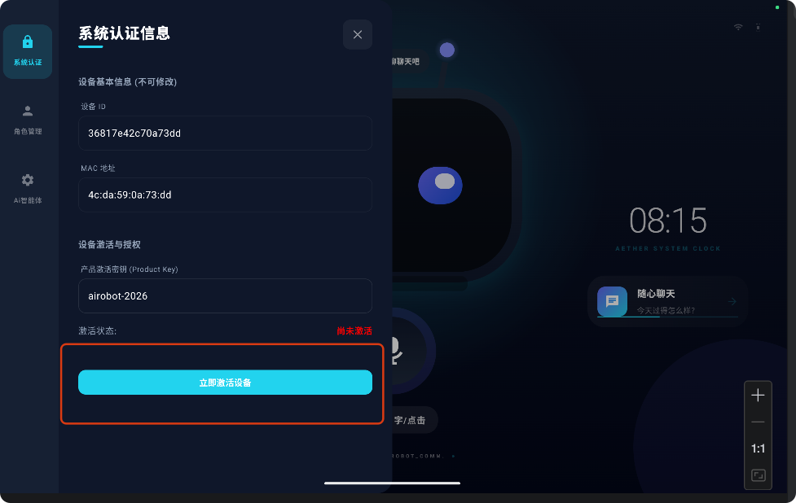
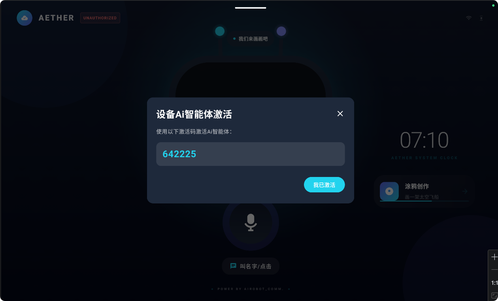

<div align="center">


**基于多智能体平台、极具生命力的动画互动与全语音交互airobot系统**

[📖 项目简介](#-项目简介) • [✨ 核心功能](#-核心功能) • [🚀 快速开始](#-快速开始) • [📱 应用场景](#-应用场景) • [📅 开发计划](#-开发计划) • [🤝 社区贡献](#-社区贡献)

</div>

---

## 📖 项目简介

**AiRobot Assistant** 是一款高度可定制、支持多种领先 Agent 平台（如小智AI、Coze、Dify等）无缝接入的实体 AI 机器人客户端系统。本项目专为大屏安卓平板及具有屏幕的桌面级机器人硬件设计。

有别于传统的语音助手，本项目融合前沿大模型能力，**以“动态情感交互”与“主动式场景服务”为核心**。通过生动细腻的动画 IP 角色表现、极速流畅的全语音交互体验，以及按需下发的扩展卡片机制，为不同维度的用户群体提供有温度的、沉浸式的“数字生命”陪伴。AiRobot 突破单向问答局限，将交互真正升级为主动服务体验，更懂用户的真实诉求。

### 🎯 核心定位

- **🤖 多引擎智能底座**：解耦式底层设计，支持灵活挂载百花齐放的 Agent 平台（如小智AI、Coze、Dify），按需享受最顶尖的大模型与生态能力。
- **🎭 沉浸式数字生命**：以细腻灵动的多角色动画 IP 形式呈现，赋予AI“生命力”，带来超越纯文本与生硬声音的真实物理陪伴感。
- **🗣️ 全语音极致交互**：全双工、全语音交互机制，支持极速语音唤醒、流式录音、实时人声识别与双向打断机制。
- **🧩 动态卡片式服务**：首创按需扩展的主动服务卡片闭环，AI 在聊天语境中不仅给出语音回复，还能主动为用户推送相应的服务卡片（如番茄时钟、天气提醒、备忘录等）。

---

## 📸 应用截图

<div align="center">
  <table style="width: 100%; border-collapse: collapse;">
    <tr>
      <td align="center" style="width: 33%;">
        <b>首页效果</b><br/>
        
      </td>
      <td align="center" style="width: 33%;">
        <b>对话交互</b><br/>
        
      </td>
      <td align="center" style="width: 33%;">
        <b>功能卡片</b><br/>
        
      </td>
    </tr>
  </table>
</div>

---

## ✨ 核心功能

### 🎭 动画互动 (Animation Interaction)
- **多角色 IP 呈现**：支持 3D/2D 动画角色的无缝切换呈现，高度定制角色表现形式。
- **灵动情感呈现**：角色拥有顺畅的聆听、思考、表达、闲置等丰富的状态机动画切换，配合语意情感自然过渡，拒绝机械呆板的界面。
- **视觉反馈增强**：提供网络异常、唤醒监听、处理中等丰富视觉微交互效果，让每一条系统指令都能被直观感知。

### 🗣️ 全语音交互 (Full Voice Interaction)
- **极速离线唤醒**：集成高效关键词唤醒算法（KWS），即时响应唤醒词并切入对话状态。
- **VAD 智能检测**：提供精准的语音活动检测（Voice Activity Detection），自动进行断句与静音结束检测。
- **底噪抑制与回声消除处理**：结合设备硬件能力优化 AEC 算法与录音增益，让远场拾音和复杂噪声环境下的对话体验同样精确。

### 🧩 按需扩展的功能卡片服务 (On-demand Function Cards)
- **服务自动触达**：智能体意图识别后，可携带扩展的卡片协议命令动态拉起界面卡片，实现“聊即所得”。
- **全场景业务模版**：内置或支持扩展丰富的卡片功能，当前囊括：专注番茄钟、AI备忘录、事务闹钟、多媒体播客面板等。
- **无限扩展体验**：基于系统极佳的可扩展性（借鉴 MCP 能力协议层），开发者能迅速添加各类生活或办公实用功能，让功能卡片无缝植入机器人大脑。

---

## 📱 应用场景

### 🏠 智能桌搭与信息牌
- **美学桌面牌**：作为个性化桌面陪伴利器，展示时钟、天气流或是极具观赏性的数字IP动态。
- **办公小秘书**：通过语音快速设定事务脑图、发起日程记录、番茄专注时钟等。

### 👶👧 儿童教育与陪伴
- **全天候 AI 伴学**：耐心解答孩童的各类问题，并采用动态视窗及功能面板将复杂的知识点可视化展现。
- **温柔情感辅导**：凭借有亲和力、具象化的角色动作及温和声音体验，为儿童带来积极的心理引导与成长陪伴。

### 🏢 门店迎宾与业务引流
- **互动接待员**：部署于接待前台或线下展会，它能凭借动态神态和全双工语音主动招呼顾客并介绍展品特色。
- **可视导览**：语音询问后主动展开各类业务信息图文卡片，促成导购转化。

### 🧓 养老关怀
- **生活提醒利器**：以极大字体和清晰提示下发吃药提醒面板、每日重点新闻卡板。
- **温暖陪伴守护**：打破老年群体的触控障碍，全语音顺畅沟通，提供零门槛的老年谈心与信息问询通道。

---

## 🔖 使用方法

使用方案主要分为两步：

1. **第一步：系统设备激活**
   安装应用后，首先在“系统设置”的系统认证页内点击激活设备。**备注：当前系统仅支持小智 AI 智能体**（对 Coze/JoyAgent、Dify 等平台的支持已规划在后续版本中）。
   
   

2. **第二步：小智后台智能体绑定**
   进入 AI 智能体配置项获取界面上弹出的“设备 Ai 智能体激活码”（如：`642225`），随后前往小智 AI 后台，将该激活码加入到您创建好的智能体配置当中，完成设备与云端智能体的绑定。

   

> **💡 备注**：小智 AI 的智能体具体配置，请详细参考小智 AI 官方使用手册。
> - **小智 AI 官方后台管理**：[xiaozhi.me](https://xiaozhi.me)

---

## 🚀 快速开始

### 📋 环境要求
- **IDE**：推荐 Android Studio 最新稳定版 (Koala 或更新)
- **开发套件**：Android SDK (API 34/35+), Android Gradle Plugin 9+
- **环境要求**：Kotlin 2.0+, 建议搭载 Android 11.0+ 对应设备效果更佳

### 📦 安装与运行步骤

1. **克隆项目源码**
   ```bash
   git clone https://github.com/your-org/airobot-assistant.git
   cd airobot-assistant
   ```
2. **导入项目并配置**
   - 使用 Android Studio 打开该目录。
   - 参考项目中的 `keystore/` 设置自己的签名属性（或遵循 `./doc/rules.md` 中的要求和安全规范设置环境变量）。
3. **构建与体验**
   - 连接 Android 大屏平板或相关开发硬件设备。
   - 编译并推送 `app` 安装：点击 Android Studio 的 **Run** 按钮。
   - 打开设备联网，设置好 Agent 后端地址环境，唤醒即可体验极致顺滑的交互和卡片推送。

---

## 📅 开发计划

- [x] **v1.0：表现引擎与单向联动基座建设**
  - [x] 确立基础架构与系统 Vibe 流程标准
  - [x] 基于 ViewModel 状态机的多角色动画表现层
  - [x] TTS 语音合成反馈及对话链路的初步跑通
  - [x] 按需功能卡片底座开发与 UI 模板示范（番茄钟、文字卡板）
- [ ] **v1.1：全网音链路深化与协议标准化**
  - [ ] 接入并优化 KWS 与 VAD 双引擎实时打断机制
  - [ ] 同步或对接主流 Agent (Coze / Dify 等 API 桥接及 WebSocket 协议)
  - [ ] 实现通信协议规范中各指令（如音量调控、系统指令）的完全支持
- [ ] **v2.0：生态繁荣与 MCP 服务开放**
  - [ ] 加深 MCP 分发服务协议应用，允许三方灵活上架各类小程序应用级智能卡片
  - [ ] 结合应用场景强化 3D 模型的物理反应及表情表现库
- [ ] **v3.0：迈向硬件终端生态**
  - [ ] 构建白牌定制屏幕硬件及 OS 极简深度修改打包方案

---

## 📚 项目文档

深入了解代码底色与架构方案，请查阅以下资料：

- **[项目规则]**：[`./doc/rules.md`](./doc/rules.md) - 项目 Vibe Code 执行规则与基础约定
- **[技术架构]**：[`./doc/architect.md`](./doc/architect.md) - 项目代码架构与技术规范大纲
- **[系统原型设计]**：`./prototype` - 项目 Web 端系统原型可交互操作展示
- **[界面设计图片]**：`./doc/design` - 功能界面的相关原始手稿与视觉设计参考
- **[通信协议说明]**：`./doc/protocol.md` - AiRobot 与后端 Agent 进行 WebSocket 通讯指令设计的详尽内容文档

---

## 🤝 社区贡献

Ai 机器人社区产品天然拥有极高的定制化属性与庞大的市场潜力，我们非常期待与来自互联网和实业领域的众多同伴合作与共创开发！

### 🌟 合作维度
- **🎯 AI 技术极客**：参与底座音频链路优化及创新 ai 机器人功能卡片开发，共同拓展海量 MCP 服务能力。
- **🛠️ 硬件方案商**：欢迎具备成熟研发与投产实力的硬件/模组供应链体系共同合作整机设计。
- **🌍 行业解决商**：针对智慧门店、儿童教育服务、康复陪伴与银发事业，探讨共推行业定制落地方案合作。

### 🎯 开发贡献流程
1. **Fork** 本仓库至你的 GitHub 组织或用户下
2. **创建功能分支**：`git checkout -b feature/awesome-card`
3. **提交优化代码**：`git commit -m "feat: Add newly developed awesome card"`
4. **推送到远程分仓**：`git push origin feature/awesome-card`
5. 向主仓库发起 **Pull Request**

> **💡 温馨提醒**：我们欢迎任何人通过 **Issue** 反馈意见建议或交流奇思妙想。如果在开发前有想法，请先行在 Issue 与我们探讨。所有贡献代码请保证按照项目声明的 Kotlin 代码规范和 Vibe 工程学架构执行。

---

## 🌍 Ai机器人社区 (AiRobot Community)

加入我们，开启智能机器人共创之旅！**Ai机器人社区**是一个连接极客、硬件方案商和行业应用者的开放生态。我们致力于打造具备灵动生命力的开源数字生命，让 AI 机器人走进千家万户。共同探讨 AI 硬件的无限可能，共创 AI 时代的交互未来。

- **🔗 关注我们的最新动态**：[Ai机器人社区 - 小红书](https://www.xiaohongshu.com/user/profile/5c2851dc0000000007038e53)

---

<div align="center">
  <p>以心智创造生命，用科技温暖生活。</p>
</div>
