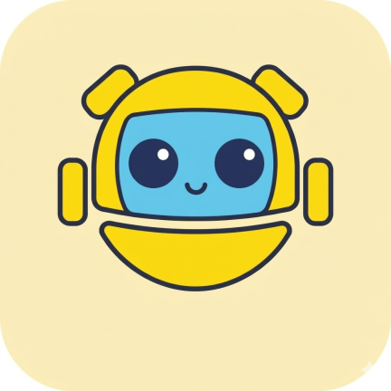

<div align="center">



# AiRobot Tablet


**基于本地端侧智能体、极具生命力的动画互动与全语音交互 airobot 系统**

[📖 项目简介](#-项目简介) • [✨ 核心功能](#-核心功能) • [📱 应用场景](#-应用场景) • [🔖 使用方法](#-使用方法) • [🚀 开发指南](#-开发指南) • [🌍 Ai机器人社区](#-ai机器人社区)

</div>

---

## 📖 项目简介

**AiRobot Tablet** 是一款专为大屏安卓平板及具有屏幕的桌面级机器人硬件设计的实体 AI 机器人客户端系统。本项目是 `airobot-assistant` 的升级迭代版本，核心演进在于从集成第三方 Agent 平台（如 Coze、Dify 等）转向 **本地端侧智能体 (Local Edge Agentic)** 架构。

有别于传统的语音助手，本项目融合前沿大模型能力，**以“动态情感交互”与“主动式场景服务”为核心**。通过生动细腻的动画 IP 角色表现、极速流畅的全语音交互体验，以及按需下发的扩展卡片机制，为不同维度的用户群体提供有温度的、沉浸式的“数字生命”陪伴。AiRobot 突破单向问答局限，将交互真正升级为主动服务体验，更懂用户的真实诉求。

### 🎯 核心定位

- **🤖 本地端侧智能体**：采用端侧大模型与 Agentic 架构，确保数据隐私安全的同时，提供毫秒级的响应体验，不再依赖第三方云端智能体平台。
- **🎭 沉浸式数字生命**：以细腻灵动的多角色动画 IP 形式呈现，赋予AI“生命力”，带来超越纯文本与生硬声音的真实物理陪伴感。
- **🗣️ 全语音极致交互**：全双工、全语音交互机制，支持极速语音唤醒、流式录音、实时人声识别与双向打断机制。
- **🧩 动态卡片式服务**：首创按需扩展的主动服务卡片闭环，AI 在聊天语境中不仅给出语音回复，还能主动为用户推送相应的服务卡片（如番茄时钟、天气提醒、备忘录等）。

### 📸 应用截图

<div align="center">
  <table style="width: 100%; border-collapse: collapse;">
    <tr>
      <td align="center" style="width: 33%;">
        <b>首页效果</b><br/>
        
      </td>
      <td align="center" style="width: 33%;">
        <b>对话交互</b><br/>
        
      </td>
      <td align="center" style="width: 33%;">
        <b>功能卡片</b><br/>
        
      </td>
    </tr>
  </table>
</div>

---

## ✨ 核心功能

### 🎭 动画互动 (Animation Interaction)
- **多角色IP呈现**：支持 3D/2D 动画角色的无缝切换呈现，高度定制角色表现形式、互动效果。
- **灵动情感呈现**：角色拥有顺畅的聆听、思考、表达、闲置等丰富的状态机动画切换，配合语意情感自然过渡，拒绝机械呆板的界面。
- **视觉反馈增强**：提供网络异常、唤醒监听、处理中等丰富视觉微交互效果，让每一条系统指令都能被直观感知。

### 🗣️ 全语音交互 (Full Voice Interaction)
- **极速离线唤醒**：集成高效关键词唤醒算法（KWS），即时响应唤醒词并切入对话状态。
- **VAD 智能检测**：提供精准的语音活动检测（Voice Activity Detection），自动进行断句与静音结束检测。
- **底噪抑制与回声消除处理**：结合设备硬件能力优化 AEC 算法与录音增益，让远场拾音和复杂噪声环境下的对话体验同样精确。

### 🧩 按需扩展的功能卡片服务 (On-demand Function Cards)
- **服务自动触达**：智能体意图识别后，可携带扩展的卡片协议命令动态拉起界面卡片，实现“聊即所得”。
- **全场景业务模版**：内置或支持扩展丰富的卡片功能，当前囊括：专注番茄钟、AI备忘录、事务闹钟、多媒体播客面板等。
- **无限扩展体验**：基于系统极佳的可扩展性（借鉴 MCP 能力协议层），开发者能迅速添加各类生活或办公实用功能，让功能卡片无缝植入机器人大脑。

---

## 📱 应用场景

### 🏠 办公桌搭与信息牌
- **美学桌面牌**：作为个性化桌面陪伴利器，展示时钟、天气流或是极具观赏性的数字IP动态。
- **办公小秘书**：通过语音快速设定事务脑图、发起日程记录、番茄专注时钟等。

### 👶 儿童教育与陪伴
- **全天候AI伴学**：耐心解答孩童的各类问题，并采用动态视窗及功能面板将复杂的知识点可视化展现。
- **温柔情感辅导**：凭借有亲和力、具象化的角色动作及温和声音体验，为儿童带来积极的心理引导与成长陪伴。

### 🏢 门店迎宾与业务引流
- **互动接待员**：部署于接待前台或线下展会，它能凭借动态神态和全双工语音主动招呼顾客并介绍展品特色。
- **可视导览**：语音询问后主动展开各类业务信息图文卡片，促成导购转化。

### 🧓 养老关怀
- **生活提醒利器**：以极大字体和清晰提示下发吃药提醒面板、每日重点新闻卡板。
- **温暖陪伴守护**：打破老年群体的触控障碍，全语音顺畅沟通，提供零门槛的老年谈心与信息问询通道。

---

## 🔖 使用方法

AiRobot Tablet 采用了全新的本地端侧智能架构，使用流程更加简化：

1. **第一步：系统初始化**
   安装应用后，进入“系统设置”完成基础硬件与语音引擎的初始化配置。

1. 

2. **第二步：本地模型加载**
   确保设备存储空间充足，系统将自动加载并优化本地大模型与 Agent 引擎。

3. **第三步：唤醒即刻对话**
   无需繁琐的云端平台激活，直接通过唤醒词（如“小叶，小叶”）即可开始交流。

> **💡 备注**：为了维持更好的兼容性，当前版本仍保留了部分与主流智能体协议的桥接能力，用于开发者调试与对比。

---

## 🚀 开发指南

### 📋 环境要求
- **IDE**：推荐 Android Studio 最新稳定版 (Koala 或更新)
- **开发套件**：Android SDK (API 34/35+), Android Gradle Plugin 9+
- **环境要求**：Kotlin 2.0+, 建议搭载 Android 11.0+ 对应设备效果更佳

### 📦 安装与运行步骤

1. **克隆项目源码**
   ```bash
   git clone https://github.com/your-org/airobot-tablet.git
   cd airobot-tablet
   ```
2. **导入项目并配置**
   - 使用 Android Studio 打开该目录。
   - 参考项目中的 `keystore/` 设置自己的签名属性。
3. **构建与体验**
   - 连接 Android 大屏平板或相关开发硬件设备。
   - 编译并推送 `app` 安装：点击 Android Studio 的 **Run** 按钮。

### 📅 功能规划

- [x] **v1.0：表现引擎与单向联动基座建设**
  - [x] 确立基础架构与系统 Vibe 流程标准
  - [x] 基于 ViewModel 状态机的多角色动画表现层
  - [x] TTS 语音合成反馈及对话链路的初步跑通
- [x] **v2.0: 架构升级 - 转向本地端侧智能 (Current)**
  - [x] 重构包名与项目架构，统一为 `airobot-tablet`
  - [x] 引入端侧大模型推理引擎基础
  - [x] 优化本地 KWS 与 VAD 协同逻辑
- [ ] **v2.1: 深度端侧 Agent 能力集成**
  - [ ] 实现端侧意图识别与复杂任务编排
  - [ ] 强化 MCP 协议在本地环境下的执行效率
  - [ ] 支持多角色动画资产的离线动态加载
- [ ] **v3.0：迈向硬件终端生态**
  - [ ] 构建白牌定制屏幕硬件及 OS 极简深度修改打包方案

### 📚 项目文档

深入了解代码底色与架构方案，请查阅以下资料：

- **[项目规则]**：[`./doc/rules.md`](./doc/rules.md) - 项目 Vibe Code 执行规则与基础约定
- **[技术架构]**：[`./doc/architecture.md`](./doc/architecture.md) - 项目代码架构与技术规范大纲
- **[界面设计图片]**：`./doc/design` - 功能界面的相关原始手稿与视觉设计参考
- **[通信协议说明]**：`./doc/protocol/` - AiRobot 与后端 Agent 通讯指令详尽文档

---

## 🌍 Ai机器人社区

**AiRobot 社区**是一个连接极客、硬件方案商和行业应用者的开放生态。我们致力于推动端侧智能在陪伴、教育、养老等场景的真实落地。

### 🤝 参与我们
- **🔗 关注最新动态**：[Ai机器人社区 - 小红书](https://www.xiaohongshu.com/user/profile/5c2851dc0000000007038e53)
- **💡 贡献与合作**：本项目欢迎各种形式的共创！如果您想参与代码贡献、硬件合作或寻求行业方案，请查阅我们的 [**贡献指南 (CONTRIBUTING.md)**](./CONTRIBUTING.md)。

---

<div align="center">
  <p>以端侧智能赋能数字生命，用本地算法守护隐私温暖。</p>
</div>
